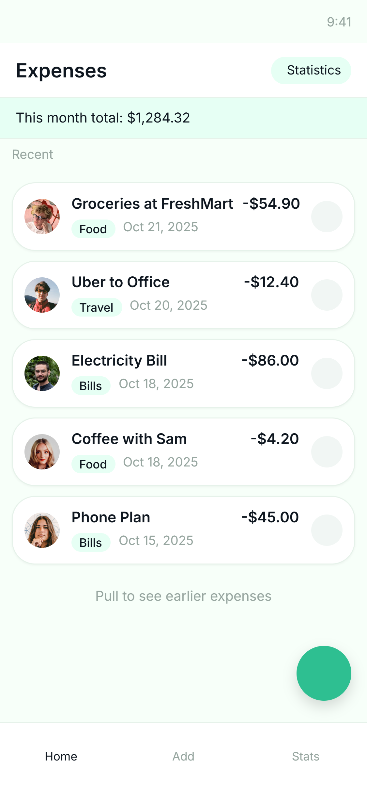
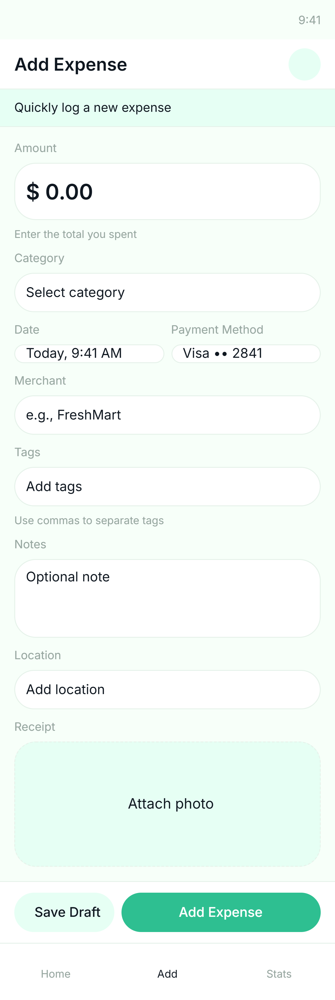
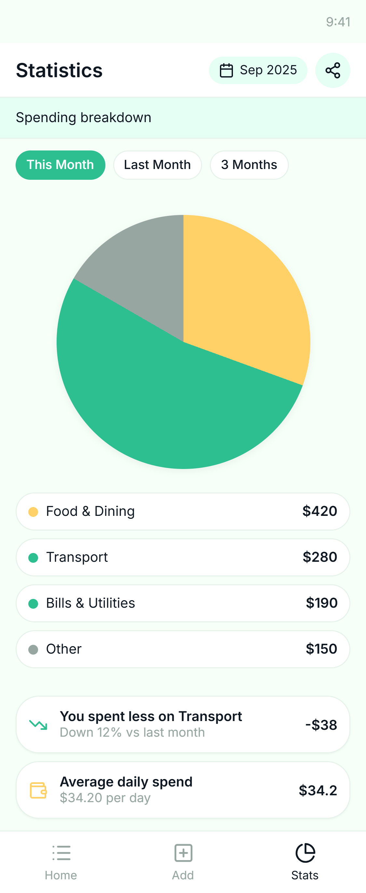

# 💰 Personal Expense Tracker (Flutter App)

[](https://flutter.dev)  
[](#license)

---

## ✨ Overview  
A sleek, offline mobile app for tracking daily expenses — designed to be minimal, intuitive and highly-responsive.  
Built by **22SW066 & 22SW103** under the supervision of **Ms. Mariam Javed**, Department of Software Engineering, Mehran University.

---

## 🧠 Problem Statement  
Managing everyday spending can get messy: manual logs are tedious, complex finance apps are overkill.  
This app offers a lightweight alternative that **works without internet** and stays simple.

---

## 💡 Solution  
- Add, view, and delete expenses  
- Visualize spending via dynamic pie-charts  
- Store all data locally using **Hive** (no network required)  
- Clean UI with smooth UX transitions

---

## 🎬 Screenshots & Demo  
<p align="center" style="display: flex; justify-content: center; gap: 20px; flex-wrap: wrap;">
  
  
  
  
</p>


---

## 🚀 Key Features  
| Feature | Description |
|---------|-------------|
| ➕ Add Expense | Record expense with title, amount, date & category |
| 📋 Expense List | View all saved expenses in an auto-updating list |
| 📊 Visual Stats | View spending distribution by category using pie-charts |
| 🧠 Offline Storage | Data is stored locally via Hive — no internet required |
| ❌ Delete Function | Easily remove unwanted entries |
| 🎨 Responsive UI | Clean design optimized for mobile screens |

---

## 🛠️ Tech Stack  
| Layer | Technology |
|-------|------------|
| Front-End | Flutter (Dart) |
| Local DB | Hive (NoSQL) |
| Charts | fl_chart |
| File & Path | path_provider |
| Code Generation | hive_generator, build_runner |

---

## 🏗️ Architecture & Flow  
lib/
│
├── main.dart
├── models/
│ └── expense_model.dart
├── pages/
│ ├── home_page.dart
│ ├── add_expense_page.dart
│ └── stats_page.dart
├── widgets/
│ └── expense_tile.dart


### Flow Summary  
1. App launches → Home Page  
2. Home Page:  
   - ➕ Add Expense → Add Expense page → Save to Hive → Back to Home  
   - 📊 View Stats → Stats page → Display pie-chart based on Hive data  
3. From list items you may optionally view details / delete  

---

## 🗄️ Local Database Integration  

### 🔧 Initialization  
```dart
void main() async {
  WidgetsFlutterBinding.ensureInitialized();
  await Hive.initFlutter();
  Hive.registerAdapter(ExpenseAdapter());
  await Hive.openBox<Expense>('expenses');
  runApp(ExpenseTrackerApp());
}


## 🧩 Common Issues & Fixes

| Issue | Cause | Solution |
|--------|--------|-----------|
| 🐝 **Hive adapter error** | Code generator not run | Run `flutter packages pub run build_runner build` |
| 🔄 **Data not updating** | Used static `ListView` | Replaced with `ValueListenableBuilder` |
| 📊 **Chart not showing** | Incorrect data mapping | Fixed category grouping logic before rendering |

---

## 📷 Screens Summary

| Screen | Purpose | Navigation |
|--------|----------|-------------|
| 🏠 **Home** | View all expenses | Default screen |
| ➕ **Add Expense** | Add new record | FAB on Home |
| 📊 **Statistics** | View spending chart | Chart icon on Home |
| 🧾 **Expense Details** | View full info | Tap expense item |

---

## 🚀 How to Run

Follow these steps to run the **Expense Tracker App** on your local system 👇

### 1️⃣ Clone the Repository
```bash
git clone https://github.com/<your-username>/Expense-Tracker.git
cd Expense-Tracker

## Install Dependencies
flutter pub get

## Generate Hive Adapters

This step is required to create the Hive type adapters used for local data storage.

flutter packages pub run build_runner build

## Run the Application
flutter run


Personal Expensive Tracker Documentation
# 💰 Personal Expense Tracker (Flutter App)

[](https://flutter.dev)  
[](#license)
